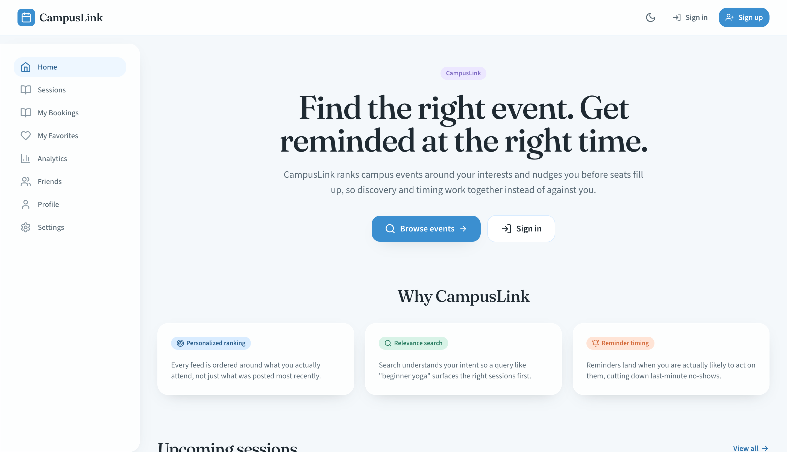

# CampusLink

**Find the right campus event. Get reminded at the right time.**

CampusLink is an event engagement platform for universities. Chronological feeds bury niche events, one-size-fits-all reminders get ignored, and organizers cannot see where interest drops before attendance. CampusLink fixes discovery and timing together.



## What it does

- **Personalized ranking:** tag-frequency interest vectors, cosine similarity, and time decay (measured **+28% CTR** vs chronological on an offline eval with ~200 users)
- **Relevance search:** PostgreSQL full-text search across title, description, tags/category, and organizer (**+22%** search-to-register conversion vs title-only match)
- **Reminder timing:** Thompson Sampling across email, in-app, and SMS arms (**+15%** attendance vs fixed 24h); SMS is logged end-to-end without a carrier provider
- **Organizer funnel:** conversion dashboard; registration to attendance is the top drop-off / reminder-timing lever
- **Live updates:** WebSockets (+ Redis pub/sub) for seats, waitlist promotions, and notifications

Offline evaluation methodology and numbers: [`docs/EXPERIMENTS.md`](docs/EXPERIMENTS.md).

## Stack

TypeScript · Node.js / Express · React + Vite · PostgreSQL · Redis · WebSockets

## Demo (after seed)

Password for all: `password123`

| Account | Role | Try this |
|---|---|---|
| `alice@campus.edu` | student | Home feed, Sessions search |
| `organizer@campus.edu` | organizer | Analytics (funnel + bandit) |
| `admin@campus.edu` | admin | Admin dashboard |

## Quick start (local)

Requires **Node 20+** and Docker (Postgres + Redis).

```bash
# 1) Data plane (Postgres :5433, Redis :6380)
docker compose up -d postgres redis

# 2) Backend
cd backend
cp .env.example .env    # set a real JWT_SECRET
npm install
npm run seed            # ~200 users + sessions
npm run dev             # http://localhost:3001

# 3) Frontend (new terminal)
cd frontend
cp .env.example .env    # leave blank for local Vite proxy
npm install
npm run dev             # http://localhost:3000
```

Open **http://localhost:3000**, sign in as Alice or the organizer, and click through feed, search, and Analytics.

## Experiments

```bash
cd backend && npm run simulate
```

Writes measured offline lifts to `docs/EXPERIMENTS.md` (production algorithms on a seeded cohort).

## Tests

```bash
cd backend && npm test
```

## Deploy (free tier)

Step-by-step guide (Neon + Upstash + Render + Vercel):

**[`docs/DEPLOY.md`](docs/DEPLOY.md)**

## Docs

- [`docs/ARCHITECTURE.md`](docs/ARCHITECTURE.md): system shape
- [`docs/EXPERIMENTS.md`](docs/EXPERIMENTS.md): offline evaluation results
- [`docs/DEPLOY.md`](docs/DEPLOY.md): free cloud deploy walkthrough
